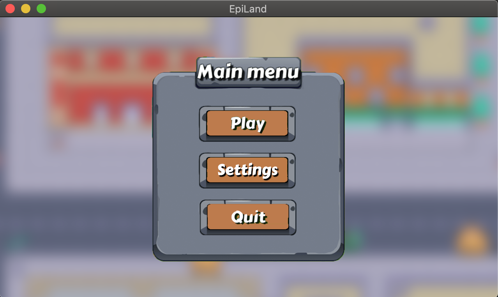

# MUL_my_rpg_2018
Réalisation d'un jeu en C (lib SFML) type RPG, réalisation des graphismes.

En collaboration avec [Maxime Demurger](https://www.linkedin.com/in/maxime-demurger-12a18b17b/?originalSubdomain=fr)

## BIENVENUE SUR NOTRE RPG EPITECH

DESCRIPTION : 
- Lancez le jeu et suivez les instructions.
- Vous devez retrouver les cartes perdues.
- Pour interragir (pour parler ou attaquer un pnj) appuyer sur 'A'.
- Marchez et dirigez vous avec les flèches du clavier.
- Ouvrez le menu avec la touche 'ESC'.
- Quittez le jeu avec la touche 'Q'.

UTILISATION : 
./my_rpg [-f] pour lancer le jeu avec un personnage féminin

## WELCOME TO THE MY_RPG GAME

DESCRIPTION : 
- Start the game and follow the instructions.
- You have to refind the lost cards.
- For interract (fight or speak with pnj) press 'A'.
- Walk on the map with keyboard arrow.
- Open the menu with 'ESC'.
- Quit thanks to 'Q'.

USAGE : 
./my_rpg [-f] for launch game with girl character

**************

### Quick Preview

Click for [Game Preview](https://drive.google.com/file/d/1CreV9VL4vBqMjx1jh6zoBmr5XYI-E2S7/view?usp=sharing)
